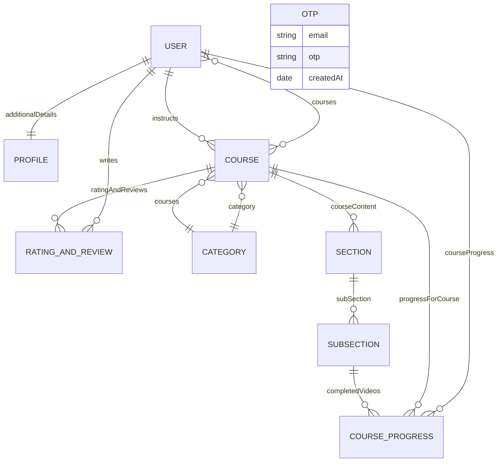

# DATA MODEL MAP

Phase 1 static audit. Schemas were not changed.

## Mermaid ERD

## Models

### User (`server/models/User.js`)

- Fields: `firstName`, `lastName`, `email`, `password`, `accountType`, `active`, `approved`, `additionalDetails`, `courses`, `token`, `resetPasswordExpires`, `image`, `courseProgress`.
- Required: `firstName`, `lastName`, `email`, `password`, `accountType`, `additionalDetails`; array item in `courses`/`courseProgress` references is typed but not globally required.
- Defaults: `active: true`, `approved: true`, timestamps.
- Indexes/unique constraints: none declared; email is not unique at schema level.
- References: `Profile`, `Course`, `courseProgress`.
- Embedded arrays: `courses`, `courseProgress`.
- Hooks/side effects: none.
- Main operations: signup/login, profile reads/updates, enrollment updates, account deletion, instructor checks.
- Controllers: `Auth`, `profile`, `payments`, `Course`, `RatingandReview`, auth middleware.
- Orphan risks: deleting user removes profile and progress in `deleteAccount`, but reviews and instructor courses are not fully cleaned; course references can diverge.
- Migration impact: should become auth/account aggregate; enrollment references likely move to dedicated `Enrollment`.

### Profile (`server/models/Profile.js`)

- Fields: `gender`, `dateOfBirth`, `about`, `contactNumber`.
- Required: none.
- Defaults: none.
- Indexes/unique constraints: none.
- References: none.
- Hooks/side effects: none.
- Main operations: created during signup, updated in profile settings, populated with user.
- Controllers: `Auth`, `profile`.
- Orphan risks: profile can orphan if user creation fails after profile creation; profile deletion occurs during account deletion.
- Migration impact: can remain separate or embed in user profile read model.

### OTP (`server/models/OTP.js`)

- Fields: `email`, `otp`, `createdAt`.
- Required: `email`, `otp`.
- Defaults: `createdAt: Date.now`.
- Indexes: TTL via `expires: 60 * 5` on `createdAt`.
- References: none.
- Hooks/side effects: pre-save hook sends verification email.
- Main operations: create in `sendotp`, read latest in `signup`.
- Controllers: `Auth`; email utility through model hook.
- Orphan risks: TTL removes documents after expiry.
- Migration impact: remove email side effect from model; move to OTP service.

### Course (`server/models/Course.js`)

- Fields: `courseName`, `courseDescription`, `instructor`, `whatYouWillLearn`, `courseContent`, `ratingAndReviews`, `price`, `thumbnail`, `category`, `studentsEnroled`, `instructions`, `status`, `createdAt`.
- Required: `instructor`; `studentsEnroled` array item has `required: true`.
- Defaults: `createdAt: Date.now`.
- Enums: `status: Draft|Published`.
- References: `user` instructor/students, `Section`, `RatingAndReview`, `Category`.
- Embedded arrays: `courseContent`, `ratingAndReviews`, `studentsEnroled`, `instructions`.
- Hooks/side effects: none.
- Main operations: course create/edit/read/delete, enrollment, dashboard, catalog.
- Controllers: `Course`, `Category`, `profile`, `payments`, `RatingandReview`.
- Orphan risks: sections/subsections can orphan if partial delete fails; Cloudinary thumbnail not cleaned; duplicated enrollment references can diverge.
- Migration impact: price/payment fields can be retired only after free enrollment replacement.

### Category (`server/models/Category.js`)

- Fields: `name`, `description`, `courses`.
- Required: `name`.
- References: `Course`.
- Main operations: create category, list categories, category page data, course create pushes course ID.
- Controllers: `Category`, `Course`.
- Orphan risks: deleted courses may remain in `Category.courses`; category course arrays can diverge.
- Migration impact: catalog read model may prefer querying courses by category instead of maintaining duplicated arrays.

### Section (`server/models/Section.js`)

- Fields: `sectionName`, `subSection`.
- Required: `subSection` array item marked required.
- References: `SubSection`.
- Main operations: create/update/delete section, populate course content.
- Controllers: `Section`, `Course`.
- Orphan risks: sections are separate documents referenced by course; failed course updates or deletes can orphan sections.
- Migration impact: embedding sections may be viable if course content is always loaded with course and section reuse is not required.

### Subsection (`server/models/Subsection.js`)

- Fields: `title`, `timeDuration`, `description`, `videoUrl`.
- Required: none.
- References: none.
- Main operations: create/update/delete lessons; progress references completed subsection IDs.
- Controllers: `Subsection`, `Section`, `Course`, `courseProgress`.
- Orphan risks: Cloudinary video not cleaned; progress can reference deleted subsection.
- Migration impact: embedding lessons may be viable, but progress references would need stable lesson IDs.

### RatingAndReview (`server/models/RatingandReview.js`)

- Fields: `user`, `rating`, `review`, `course`.
- Required: all fields.
- Indexes: `course` has `index: true`.
- References: `user`, `Course`.
- Main operations: create review, list reviews, average rating aggregation.
- Controllers: `RatingandReview`, `Course`.
- Orphan risks: deleting user/course does not remove review documents in observed controllers.
- Migration impact: may remain separate collection.

### CourseProgress (`server/models/CourseProgress.js`)

- Fields: `courseID`, `userId`, `completedVideos`.
- Required: none declared.
- References: `Course`, `user`, `SubSection`.
- Main operations: created during enrollment, read for full course/enrolled courses, updated on lecture completion.
- Controllers: `payments`, `Course`, `profile`, `courseProgress`.
- Orphan risks: course/user/subsection deletion can leave stale progress references.
- Migration impact: likely belongs with Enrollment or LearningProgress module.

## Relationship concerns

- Current enrollment representation:
  - `Course.studentsEnroled` contains user IDs.
  - `User.courses` contains course IDs.
  - `User.courseProgress` contains `CourseProgress` IDs.
  - `CourseProgress` separately stores `courseID` and `userId`.
- Student-course relationships are duplicated and can become stale.
- Course content hierarchy is normalized as Course -> Section documents -> SubSection documents.
- Progress is represented as completed subsection IDs per user/course.
- Deletion can leave orphaned references, especially reviews, category course references, Cloudinary media, and progress references.
- Embedding sections and lessons later is viable if lessons are not reused across courses; progress would need stable embedded IDs or a separate lesson identity.
- A dedicated `Enrollment` model should be strongly considered. It could own `userId`, `courseId`, enrollment status/date, and progress summary, reducing duplication between `User`, `Course`, and `CourseProgress`.
